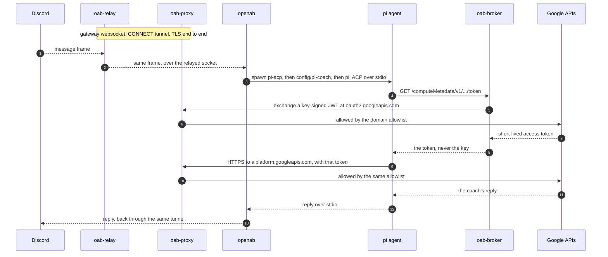

# Architecture

A map of the repository, written for someone who has read the README and wants
to know where each thing lives before opening it. It says what the pieces are
and which rules hold between them, not how each one works inside — the files
themselves do that, and a map that repeats them goes stale first.

---

## The problem being solved

An LLM agent with tools is a program that runs text it did not write. Prompt
injection is not a bug to be fixed in it; it is what the thing does. So the
question this repo answers is not "how do we stop the agent misbehaving" but:

> **When the agent is assumed compromised, what can it still reach?**

The answer it builds towards is: not the service-account key, not the internet
beyond four domains, not the host, not another session's log. What it *can*
reach is written down in [Known gaps](../README.md#known-gaps) rather than left
for a reader to discover.

---

## Four containers, two networks

| Container | Image | Network | What it is trusted with |
|---|---|---|---|
| `oab-sandbox` | `oab-sandbox:pi` (this `Dockerfile`) | `oab-int` | the vault, and nothing else |
| `oab-broker` | `broker/` | `oab-int` | the service-account key, read-only |
| `oab-relay` | `relay/` | `oab-int` | nothing; it only opens tunnels |
| `oab-proxy` | `squid` | `oab-int` + `oab-ext` | the only route to the internet |

`oab-int` is created `--internal`: containers on it have no route out at all.
`oab-proxy` is the single container on both networks, which is what makes the
allowlist in `proxy/squid.conf` a gate rather than a suggestion.

---

## One message, end to end

Steps 4 to 8 are the part worth reading twice, and
[`call-chain.md`](call-chain.md) walks all eleven of the steps they compress —
including the two library details the whole thing rests on.

---

## Codemap

Start at `run.sh`. Every runtime property this repo claims is an argument in it,
and everything else exists to support, verify, or explain one of those
arguments.

| Path | What it is |
|---|---|
| `run.sh` | Creates the networks and starts the four containers. The hardening flags live here, not in any image. |
| `stop.sh` | Archives the session log out of the tmpfs, then removes the agent. |
| `verify-hardening.sh` | Asserts the flags in `run.sh` actually took effect, from inside the running containers. |
| `Dockerfile` | A thin layer over `ghcr.io/openabdev/openab:stable-pi`: adds python3, bumps pi. It deliberately rebuilds nothing from the base. |
| `broker/server.js` | Just enough of the GCE metadata API for Google's auth libraries to accept it. About 100 lines, with an audit log. |
| `relay/` | socat alone in an alpine image, turning each connection into a `CONNECT` tunnel through squid. |
| `proxy/squid.conf` | The egress allowlist, a bandwidth pool for `r.jina.ai`, and a rule that never tunnels into a private address. |
| `config/pi-coach` | The model wrapper the agent invokes instead of `pi`. Selects the model, and unsets `HOME` — see `call-chain.md`. |
| `config/adc-marker.json` | **Not a credential.** Invalid JSON that exists only to satisfy pi's `fileExists` gate. |
| `config/config.toml.example` | Template for the agent config; the real file is gitignored. |
| `deploy/` | The LaunchAgents for the machine that hosts this permanently, and the wrapper they run. |
| `vault-sync.sh` | Moves notes between `vault/` and the main vault, with a review in the direction that needs one. |
| `learn/` | Re-runnable experiments, indexed in teaching order by `learn/README.md`. |
| `docs/findings.md` | What the plan got wrong, and what measuring it revealed. |
| `docs/call-chain.md` | The 11 steps between a keyless container and a Vertex call. |
| `docs/operations.md` | Running it: per session, always-on, and keeping the vault in step. |
| `docs/build-log.zh.md` | The raw chronological build log, in Chinese. `findings.md` is its distillation. |

---

## Invariants

These are the properties a change must not quietly break. Each one is checked by
something, and the check is named.

1. **No credential exists inside the agent container.** Not as a file, not as an
   image layer, and of the environment only `DISCORD_BOT_TOKEN`, which the bot
   cannot run without. `run.sh` passes `GCE_METADATA_HOST` and deliberately does
   not inherit `GOOGLE_APPLICATION_CREDENTIALS`. Checked by: nothing asserts
   this yet — `verify-hardening.sh` prints the *names* of what PID 1 leaks, and
   turning that list into an assertion is
   [still open](findings.md#still-open). Until then the check is reading it.
2. **The agent container has no route out except through squid.** It sits on
   `--internal`. Anything that needs a new destination needs a line in
   `proxy/squid.conf`, where it is visible. Checked by: `learn/13`, `learn/14`.
3. **A session log the agent can read is the current one only.** Sessions live
   on a tmpfs; the archive lives on the host. Checked by: `learn/dev/01`.
4. **The coaching rules are measured, never assumed.** They have no system layer
   behind them, so `learn/10-model-compliance-eval.sh` re-runs after every model
   change. Checked by: finding 6, and `grade_compliance.py` for where the line
   between a hint and a solution sits.
5. **`vault/` is the one host path the agent can write**, and nothing leaves it
   for the main vault without a human looking at the commits. Checked by:
   `vault-sync.sh back`, `learn/dev/05`.

---

## Cross-cutting

- **Credentials.** None in the repository, none in any image. The
  service-account key is mounted read-only into the broker at runtime; the
  Discord token arrives through the environment. `AGENTS.md` has the rule.
- **Language.** Everything under version control is English, with two deliberate
  exceptions named in `AGENTS.md`: the Chinese build log, and a handful of
  strings that would stop matching if translated.
- **Evidence.** A claim in this repo is supposed to be re-runnable. When a claim
  turned out to be wrong, the entry in `findings.md` says what was assumed, what
  happened, and what changed — including the ones still unresolved.
